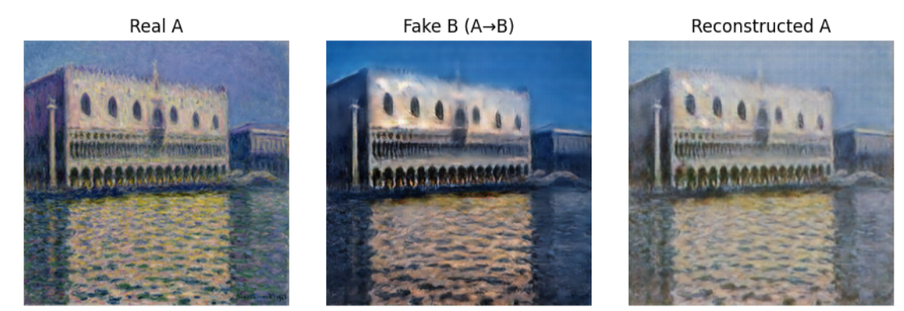

# 🎨 Neural Style Transfer with CycleGAN — Monet Style Transfer

This project applies **CycleGAN** to perform neural style transfer, translating real-world landscape photos into the style of **Claude Monet**. Unlike traditional style transfer methods that require paired datasets, CycleGAN works with **unpaired** data to learn mappings between the two visual domains.

## Overview

- **Objective**: Transform natural images into Monet-style paintings.
- **Method**: Use CycleGAN for unpaired image-to-image translation.
- **Input**: Real-world landscape photographs.
- **Output**: Artistic images rendered in the style of Monet.

##  Model Architecture

CycleGAN consists of:
- `Generator G`: Transforms photos → Monet
- `Generator F`: Transforms Monet → photos
- `Discriminator D_X`: Distinguishes real vs. generated photos
- `Discriminator D_Y`: Distinguishes real vs. generated Monet paintings

###  Loss Functions
- **Adversarial Loss**: For realistic outputs.
- **Cycle Consistency Loss**: Ensures the mapping is reversible.
- **Identity Loss** : Helps preserve colors and improves quality.

##  Dataset

We used the [Monet2Photo dataset](https://www.kaggle.com/datasets/splcher/monet2photo) containing:
- `trainA/`: Real photos
- `trainB/`: Monet paintings
- `testA/`, `testB/`: For evaluation

##  Implementation Details

- **Framework**: PyTorch
- **Training time**: ~4 hours on GPU
- **Image size**: 256x256
- **Batch size**: 16
- **Epochs**: 50 

###  Key Steps
1. Load and preprocess datasets
2. Build generator and discriminator models
3. Train CycleGAN with combined loss functions
4. Generate and visualize results

##  Results

Here are some sample outputs:
 

## Streamlit Interface

To make the model more interactive and accessible, we built a Streamlit web app that allows users to upload their own real images and get a Monet-style painting in return.

##  Technologies Used

- Python
- PyTorch
- NumPy
- Matplotlib
- PIL
- CycleGAN architecture (based on Zhu et al. 2017)
- Streamlit

##  References

- [CycleGAN Paper](https://arxiv.org/abs/1703.10593)
- [Original CycleGAN GitHub](https://github.com/junyanz/pytorch-CycleGAN-and-pix2pix)
- [Monet2Photo Dataset on Kaggle](https://www.kaggle.com/datasets/splcher/monet2photo)
